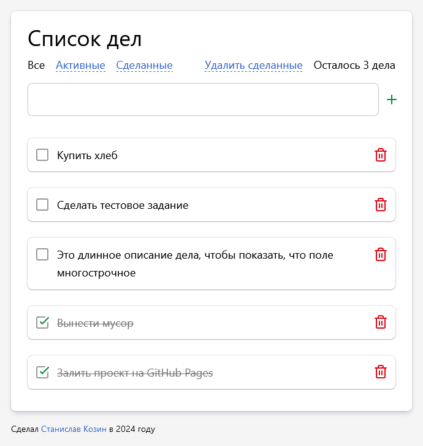
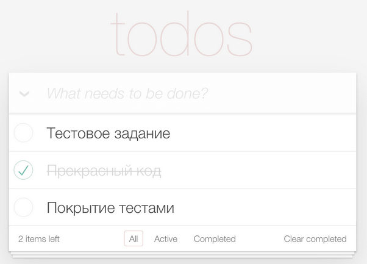

# Тестовое задание Frontend junior в Mindbox

ToDo-приложение, позволяющее управлять текущим списком дел.

[Посмотреть вживую](https://staskozin.github.io/mindbox-test-task/)

## Команды

В папке проекта можно запустить следующие команды:

### `npm start`

Запускает приложение в режиме разработки.\
Откройте [http://localhost:3000](http://localhost:3000), чтобы посмотреть в браузере.

### `npm run build`

Собирает приложение в папку `build`.

### `npm test`

Запускает тесты.

## Требования

Что должно быть в интерфейсе:
- Поле для ввода новой задачи
- Списки всех задач, невыполненных и выполненных задач (по отдельности)

Требования к коду:
- Приложение создано с использованием TypeScript, React и React Hooks
- Библиотеки компонент – на ваше усмотрение
- Ключевая на ваш взгляд функциональность обязательно покрыта тестами
- Проект должен запускаться командой `npm i && npm run start`
- Проект доступен на GitHub Pages/Vercel/etc.

Пример внешнего вида приложения:

